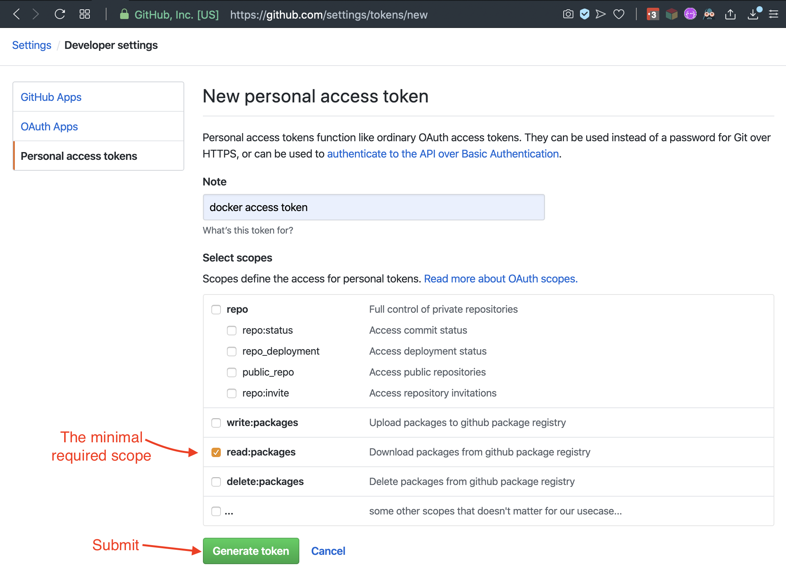

pikture2text 
============

A REST Service that converts pictures to text.

## Install via Docker

### Prerequisite 
1. generate token that is able to read packages from github at [https://github.com/settings/tokens/new](https://github.com/settings/tokens/new)

    * see github docs for [further information](https://help.github.com/en/github/authenticating-to-github/creating-a-personal-access-token-for-the-command-line)

1. afterwards add the github PKG to docker by running:

    $ docker login -u GITHUB_USERNAME -p GITHUB_TOKEN docker.pkg.github.com
    
    
### Install image

    docker pull docker.pkg.github.com/skrapeit/pikture2text/pikture2text:latest
    
### Run it

    docker run -p 8080:8080 docker.pkg.github.com/skrapeit/pikture2text/pikture2text:latest
    
